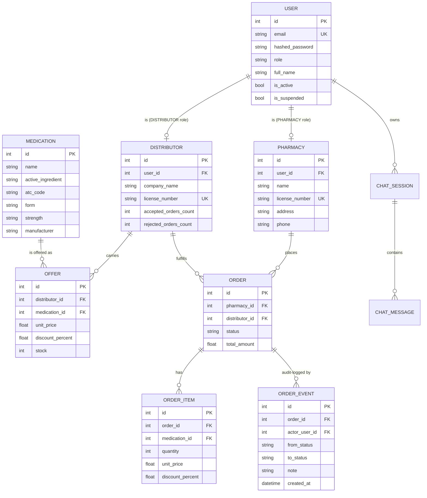

# Entity-Relationship Diagram

## Why this shape

- **One `User` table, two profile tables.** A user has exactly one role, and
  the role determines which profile (Pharmacy / Distributor) is attached.
  Admins have no profile. Keeping profiles in their own tables means
  pharmacy-specific or distributor-specific columns never bloat the user
  table.
- **`Medication` is global, `Offer` is per-distributor.** This is what
  enables the comparison feature: search a medication once, join through
  `Offer` to see every distributor that carries it.
- **`OrderItem` snapshots pricing.** We copy `unit_price` and
  `discount_percent` onto the item at creation time. A distributor changing
  their prices tomorrow must not retroactively change yesterday's order
  totals.
- **`OrderEvent` is append-only.** Every state transition writes a row; we
  never update or delete events. This gives us a complete audit trail of
  who did what to which order and when - the foundation of defendable
  "order tracking".
- **No multi-distributor orders.** An `Order` belongs to exactly one
  distributor. A pharmacy that wants medications from two distributors
  places two orders. Far simpler than partitioning a single cart and
  matches how every B2B catalog works in practice.
