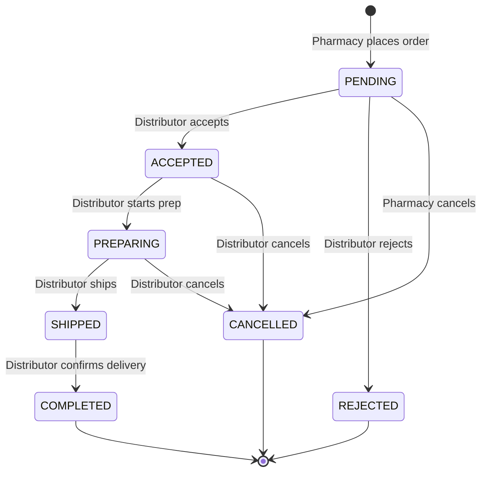

# Order State Machine

## Diagram

## Who can drive what

| Transition          | Allowed actor |
|---------------------|---------------|
| → ACCEPTED          | Distributor   |
| → REJECTED          | Distributor   |
| → PREPARING         | Distributor   |
| → SHIPPED           | Distributor   |
| → COMPLETED         | Distributor   |
| → CANCELLED (from PENDING)               | Pharmacy or Distributor |
| → CANCELLED (from ACCEPTED / PREPARING)  | Distributor             |

The state machine itself (`services/order_state.py`) only enforces *valid
transitions*. *Who* is allowed to call each one is enforced by the router
layer (`routers/orders.py`).

## Side effects

- **PENDING → ACCEPTED:**
  - Decrement the distributor's stock for each ordered medication.
  - Increment `accepted_orders_count` on the distributor.
- **PENDING → REJECTED:** Increment `rejected_orders_count` on the
  distributor. The reliability score the ranking algorithm uses is
  `accepted / (accepted + rejected)` so these counters feed Upgrade #1.
- **Every transition:** Append an `OrderEvent` row with from/to/actor/note.

## Why a separate `OrderEvent` table?

Storing only the *current* status would lose the history. With the audit
table:
- The pharmacy can see exactly when the distributor accepted, prepared,
  shipped, and completed.
- An admin can audit complaints: "the distributor took 4 days from ACCEPT
  to SHIP."
- A defense committee asking "how do you know the order was accepted at
  4:13 PM on Tuesday?" can be answered with a `SELECT * FROM order_events`.
